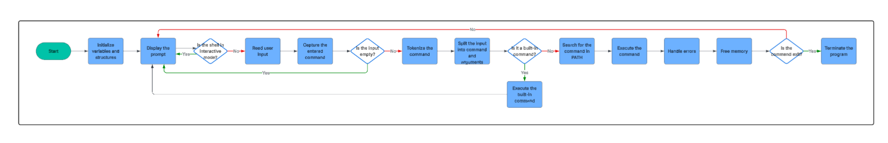

# Simple Shell - Holberton School Project


#

### Table of Contents
<details>
<summary>Click to expand</summary>

- [Description](#description)
- [Version](#version)
- [Files](#files)
- [Built-in Commands](#built-in-commands)
- [Manual Pages](#manual-pages)
- [Installation](#installation)
- [Usage](#usage)
- [Memory Leak Check](#memory-leak-check)
- [Authors &copy;](#authors--copy)

</details>

#### Description
Simple Shell is a simple UNIX command interpreter written in C. It is designed to mimic the behavior of the original Bourne shell `(sh)` and provides a basic command-line interface for users to execute commands and manage processes.

#### Version
- `1.0.0` - Initial release - 2025-04-23

#

#### Files
| File | Description | Link |
| ---- | ----------- | ---- |
| `shell.h` | Header file containing function prototypes and structure definitions. | [View](shell.h) |
| `shell.c` | Main shell program that handles user input and command execution. | [View](shell.c) |
| `execute_command.c` | Functions for executing commands and managing processes. | [View](execute_command.c) |
| `tokenize.c` | Tokenization of user input into command and arguments. | [View](tokenize.c) |
| `environement.c` | Functions for managing environment variables. | [View](environment.c) |
| `builtins.c` | Implementation of built-in shell commands (cd, exit, env). | [View](builtins.c) |
| `utils.c` | Utility functions for string manipulation and error handling. | [View](utils.c) |
| `path.c` | Functions for searching and executing commands in the system PATH. | [View](path.c) |
| `empty_line.c` | Functions for handling empty lines and comments in user input. | [View](empty_line.c) |
| `prompt.c` | Functions for displaying the shell prompt and handling user input. | [View](prompt.c) |
| `input.c` | Functions for reading user input from the command line. | [View](input.c) |

#### Built-in Commands
| Command | Description |
| ------- | ----------- |
| `cd` | Change the current directory. |
| `exit` | Exit the shell. |
| `env` | Display the current environment variables. |

#### Manual Pages
```bash
$ man ./man_1_simple_shell
```

#### Installation
To install and run the Simple Shell, follow these steps:
1. Clone the repository:
```bash
$ git clone https://github.com/Terencetjt26/holbertonschool-simple_shell.git
$ cd holbertonschool-simple_shell
```

2. Compile the source code:
```bash
$ gcc -Wall -Werror -Wextra -pedantic -std=gnu89 *.c -o hsh
```
3. Run the shell:
```bash
$ ./hsh
```

#### Usage
> The shell can be used interactively or in a non-interactive mode. In interactive mode, it will prompt the user for input and execute commands. In non-interactive mode, it can read commands from a file or standard input.
##### Example
```bash
$ ./hsh
root@cisfun:/home/ubuntu/holbertonschool-simple_shell$ ls
AUTHORS  README.md  builtins.c  environement.c  execute_command.c  hsh  man_1_simple_shell  path.c  shell.c  shell.h  tokenize.c  utils.c
root@cisfun:/home/ubuntu/holbertonschool-simple_shell$ pwd
/home/ubuntu/holbertonschool-simple_shell
root@cisfun:/home/ubuntu/holbertonschool-simple_shell$ echo hello-world
hello-world
root@cisfun:/home/ubuntu/holbertonschool-simple_shell$ exit
$
```

In the non-interactive mode, you can run the shell with input redirection:
```bash
$ echo "ls -l" | ./hsh
total 64
-rw-r--r-- 1 root root   141 Apr 23 15:03 AUTHORS
-rw-r--r-- 1 root root  3414 Apr 23 15:30 README.md
-rw-r--r-- 1 root root  1396 Apr 23 15:03 builtins.c
-rw-r--r-- 1 root root   655 Apr 23 15:03 environement.c
-rw-r--r-- 1 root root   453 Apr 23 15:03 execute_command.c
-rwxr-xr-x 1 root root 17592 Apr 23 15:07 hsh
-rw-r--r-- 1 root root     2 Apr 23 15:03 man_1_simple_shell
-rwxr-xr-x 1 root root   684 Apr 23 15:03 path.c
-rwxr-xr-x 1 root root  1398 Apr 23 15:03 shell.c
-rwxr-xr-x 1 root root  1320 Apr 23 15:03 shell.h
-rw-r--r-- 1 root root   528 Apr 23 15:03 tokenize.c
-rwxr-xr-x 1 root root  1076 Apr 23 15:03 utils.c
$
```

#### Memory Leak Check
```bash
$ valgrind ./hsh
==7113== Memcheck, a memory error detector
==7113== Copyright (C) 2002-2022, and GNU GPL'd, by Julian Seward et al.
==7113== Using Valgrind-3.22.0 and LibVEX; rerun with -h for copyright info
==7113== Command: ./hsh
==7113== 
root@cisfun:/home/ubuntu/holbertonschool-simple_shell$ ^C==7113== 
==7113== Process terminating with default action of signal 2 (SIGINT)
==7113==    at 0x497AA61: read (read.c:26)
==7113==    by 0x48F17A4: _IO_file_underflow@@GLIBC_2.2.5 (fileops.c:517)
==7113==    by 0x48E5E0F: getdelim (iogetdelim.c:77)
==7113==    by 0x109B2B: process_input (in /home/ubuntu/holbertonschool-simple_shell/hsh)
==7113==    by 0x1099D6: main (in /home/ubuntu/holbertonschool-simple_shell/hsh)
==7113== 
==7113== HEAP SUMMARY:
==7113==     in use at exit: 2,168 bytes in 3 blocks
==7113==   total heap usage: 3 allocs, 0 frees, 2,168 bytes allocated
==7113== 
==7113== LEAK SUMMARY:
==7113==    definitely lost: 0 bytes in 0 blocks
==7113==    indirectly lost: 0 bytes in 0 blocks
==7113==      possibly lost: 0 bytes in 0 blocks
==7113==    still reachable: 2,168 bytes in 3 blocks
==7113==         suppressed: 0 bytes in 0 blocks
==7113== Rerun with --leak-check=full to see details of leaked memory
==7113== 
==7113== For lists of detected and suppressed errors, rerun with: -s
==7113== ERROR SUMMARY: 0 errors from 0 contexts (suppressed: 0 from 0)
```

#### Flowchart



#### Authors &copy;
- **Martin Clement** - [Github Profile](https://github.com/ItsZmainDev)
- **Terence Tengue** - [Github Profile](https://github.com/Terencetjt26)